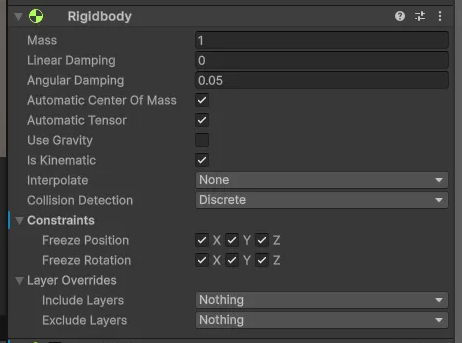
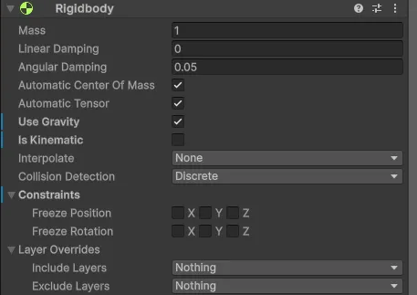

# Лабораторная работа №2

1.5

1. Примитивы скатываются с горки:
    - Dynamic Friction = 0
    - Static Friction = 0
    - Bounciness = 0
    - Friction Combine = Minimum
    - Bounce Combine = Average
2. Примитивы отскакивают от горки:
    - Dynamic Friction = 0.5
    - Static Friction = 0.5
    - Bounciness = 0.9
    - Friction Combine = Minimum
    - Bounce Combine = Average

1.6

1. Скатывание (нет трения):
    - Dynamic Friction = 0
    - Static Friction = 0
    - Bounciness = 0
    - Friction Combine = Minimum
    - Bounce Combine = Average
2. Отскок (умеренное трение и высокая прыгучесть):
    - Dynamic Friction = 0.5
    - Static Friction = 0.5
    - Bounciness = 0.9
    - Friction Combine = Minimum
    - Bounce Combine = Average

1.8

Для первого звена:

Для остальных:

1.11

- Rigidbody: Для правильного поведения сцены оба объекта (цепь и коробка) должны иметь Rigidbody компоненты с включенным `UseGravity`. Коробка должна быть настроена так, чтобы она падала под воздействием силы тяжести, а цепь должна иметь `IsKinematic = false`, чтобы она могла правильно взаимодействовать с другими объектами.
- Collider: У цепи должен быть MeshCollider, чтобы она взаимодействовала с коробкой. У коробки должен быть тоже MeshCollider, чтобы она могла реагировать на столкновения с цепью.

1.12

В этой лабораторной работе я изучил, как работают коллайдеры в Unity и как с их помощью можно создавать реалистичные взаимодействия объектов. Например, я научился настраивать трение и прыгучесть материалов, чтобы объекты правильно скатывались с горки или отскакивали от неё. Эти знания полезны для создания игровых механик, где объекты взаимодействуют друг с другом, например, при столкновении или падении. Понимание того, как работают коллайдеры и физические материалы, поможет создавать более интересные и динамичные игры, а также симуляции.
